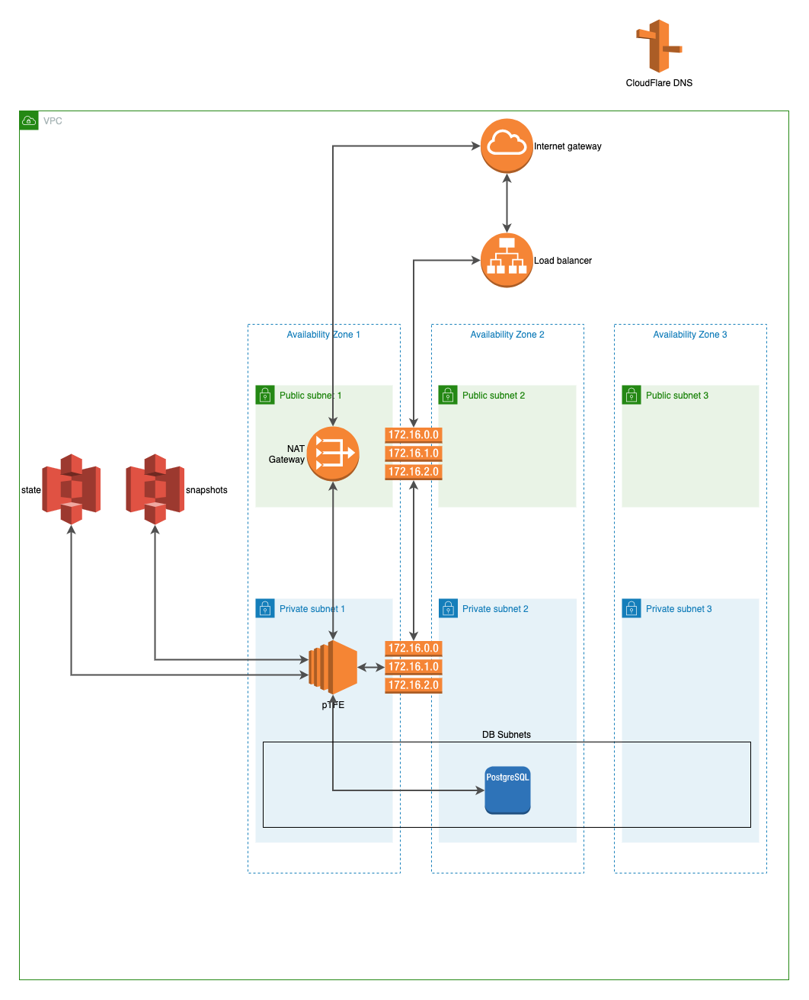
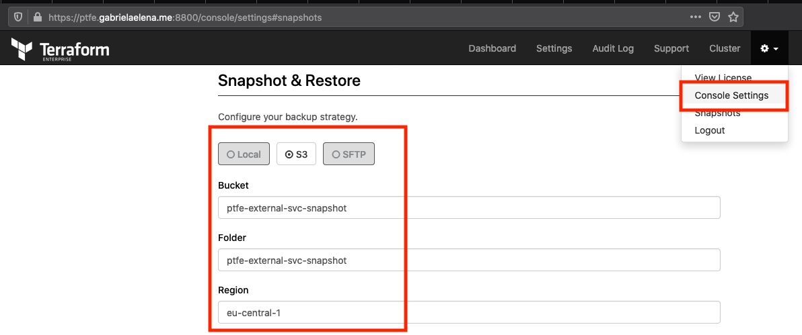
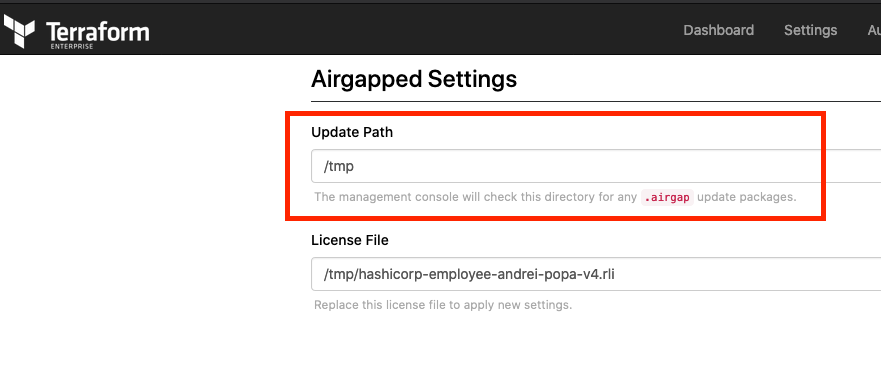
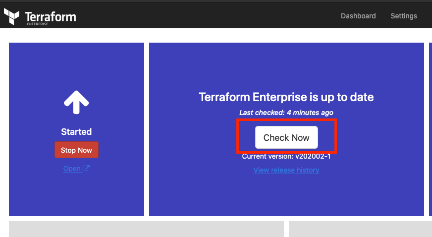
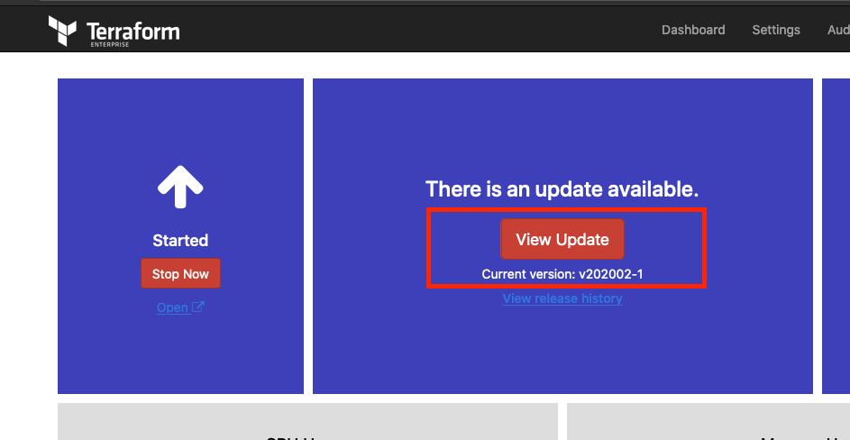
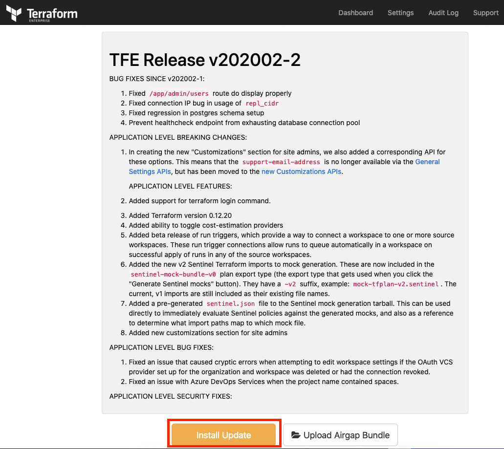
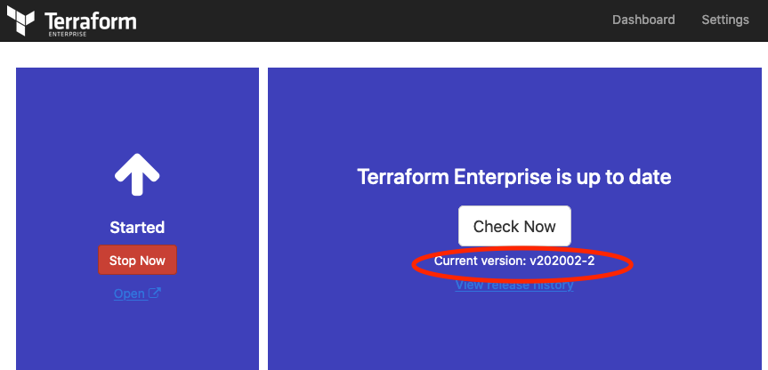

# Description
Private Terraform installation and upgrade path using airgap installation mode. Based on modular installation using external services.

The diagram for private Terraform would be the following. As this example is airgap (offline) installation, the diagram below would have [additional s3 bucket](https://github.com/andrewpopa/ptfe-aws-es-upgrade/tree/master/installation) with all the assets needed to perform the install 



# Pre-requirements
- [Terraform](https://www.terraform.io)
- [PTFE](https://www.terraform.io/docs/enterprise/index.html)
- License (provided by HashiCorp)
- Get Letsencrypt certificate (or any other valid)
- DNS [record](https://www.cloudflare.com/)
- [AWS](https://aws.amazon.com) account
  - we will use m5.large as [recommended](https://www.terraform.io/docs/enterprise/before-installing/reference-architecture/aws.html) type

# Terraform version
This module was written and tested with Terraform `v0.12.23`

# Assumptions
- You want to install and upgrade private TFE using terraform code and external service with offline airgap installation
- You have access to AWS console where you can create you security credentials `AWS_ACCESS_KEY_ID` and `AWS_SECRET_ACCESS_KEY`
- You configured your security credentials as your environment variables `~/.bash_profile` 

```
export AWS_ACCESS_KEY_ID=XXXX
export AWS_SECRET_ACCESS_KEY=XXXX
export AWS_DEFAULT_REGION=XXXX
```

# How to consume

```bash
git clone git@github.com:andrewpopa/ptfe-aws-es-upgrade.git
cd ptfe-aws-es-upgrade
```

## Dependencies
- [vpc](https://github.com/andrewpopa/terraform-aws-vpc) - AWS VPC provisioning
- [security-group](github.com/andrewpopa/terraform-aws-security-group) - AWS security group provisioning
- [alb](https://github.com/andrewpopa/terraform-aws-alb) - AWL application load balancer provisioning
- [rds](https://github.com/andrewpopa/terraform-aws-rds) - AWS RDS(postgreSQL) instance provisioning
- [ptfe-es](https://github.com/andrewpopa/terraform-aws-s3) - AWS S3 bucket for state files
- [ptfe-es-snapshot](https://github.com/andrewpopa/terraform-aws-s3) - AWSS3 bucket for TFE snapshot
- [dns](https://github.com/andrewpopa/terraform-cloudflare-dns) - Cloudflare DNS management
- [key-pair](https://github.com/andrewpopa/terraform-aws-key-pair) - SSH key-pair for EC2 instance
- [ec2](https://github.com/andrewpopa/terraform-aws-ec2) - AWS EC2 instance 
- [iam-profile](https://github.com/andrewpopa/terraform-aws-iam-profile) - IAM instance profile to lunch with
- [silent](https://github.com/andrewpopa/ptfe-aws-es-upgrade/tree/master/modules/silent) - silent module which does installation
  - [installation s3 bucket](https://github.com/andrewpopa/ptfe-aws-es-upgrade/tree/master/installation) - Separate TF code to create S3 bucket with all configuration files and installation packages
  - List of dependencies packages and configuration files which need to be copied to separate created s3 bucket
    ```bash
    -rw-r--r--@  1 apopa  staff  1064025557 Mar 23 22:50 Terraform-Enterprise-417.airgap
    -rw-r--r--@  1 apopa  staff  1064012307 Mar 23 22:50 Terraform-Enterprise-419.airgap
    -rw-r--r--   1 apopa  staff        1954 Mar 23 22:50 application-settings.json
    -rw-r--r--   1 apopa  staff    22610446 Mar 23 22:50 containerd.io_1.2.6-3_amd64.deb
    -rw-r--r--   1 apopa  staff    12993236 Mar 23 22:50 docker-ce-cli_18.09.2~3-0~ubuntu-xenial_amd64.deb
    -rw-r--r--   1 apopa  staff    17371786 Mar 23 22:50 docker-ce_18.09.2~3-0~ubuntu-xenial_amd64.deb
    -rw-r--r--@  1 apopa  staff       10752 Mar 23 22:50 hashicorp-employee-andrei-popa-v4.rli
    -rw-r--r--@  1 apopa  staff       38292 Mar 23 22:50 libltdl7_2.4.6-0.1_amd64.deb
    -rw-r--r--   1 apopa  staff         254 Mar 23 22:50 postgresql.sql
    -rw-r--r--   1 apopa  staff         499 Mar 23 22:55 replicated.conf
    -rw-r--r--@  1 apopa  staff   781721778 Mar 23 22:50 replicated.tar.gz
    -rw-r--r--   1 apopa  staff        1449 Mar 23 22:50 silent_restore.sh
    ➜  files git:(master) ✗ pwd
    ../ptfe-aws-es-upgrade/files
    ```

## Installation Sequence
- S3 for [installation packages](https://github.com/andrewpopa/ptfe-aws-es-upgrade/tree/master/installation) need to be installed first
- Populate main installation with S3 name and arn
  - [arn](https://github.com/andrewpopa/ptfe-aws-es-upgrade/blob/master/main.tf#L119)
  - [name](https://github.com/andrewpopa/ptfe-aws-es-upgrade/blob/master/main.tf#L175)
- Populate all inputs in current `main.tf`

## Inputs
| **Name**  | **Type** | **Default** | **Required** | **Description** |
| ------------- | ------------- | ------------- | ------------- | ------------- |
| fqdn | string | module.dns.fqdn | yes | FQDN where you are deploying pTFE |
| dashboard_default_password | string |  | yes | Admin panel password |
| pg_dbname | string | module.rds.db_name | yes | RDS name |
| pg_netloc | string | module.rds.rds_ip | yes | RDS fqdn |
| pg_password | string | Password123# | yes | RDS password |
| pg_user | string | module.rds.db_username | yes | RDS user |
| s3_bucket_svc | string | module.ptfe-es.s3_bucket_id | yes | S3 bucket for state files |
| s3_region | string | module.ptfe-es.s3_bucket_region | yes | S3 region |
| s3_bucket_svc_snapshots | string | module.ptfe-es-snapshot.s3_bucket_id | yes | S3 bucket for snapshots |
| s3_installation_bucket | string |  | yes | [separate S3 bucket](https://github.com/andrewpopa/ptfe-aws-es-upgrade/tree/master/installation) |
| tls_cert | string | /tmp/fullchain1.pem | yes | path to certificate |
| tls_key | string | /tmp/privkey1.pem | yes | path to private key |
| settings_file | string | /tmp/application-settings.json | yes | path to application settings |
| license_file | string | /tmp/hashicorp-employee-andrei-popa-v4.rli | yes | path to license file |
| airgap_binary | string | /tmp/Terraform-Enterprise-417.airgap | yes | path to airgap installation package |
| docker_cli | string | docker-ce-cli_18.09.2~3-0~ubuntu-xenial_amd64.deb | yes | Docker dependencies |
| docker_ce | string | docker-ce_18.09.2~3-0~ubuntu-xenial_amd64.deb | yes | Docker package |
| containerd | string | containerd.io_1.2.6-3_amd64.deb | yes | Docker dependencies |
| lib_dep | string | libltdl7_2.4.6-0.1_amd64.deb | yes | Docker dependencies |
| airgap_installer | string | replicated.tar.gz | yes | airgap [installation](https://install.terraform.io/airgap/latest.tar.gz) package |

## Outputs
| **Name**  | **Type** | **Description** |
| ------------- | ------------- | ------------- |
| ec2_public_ip | string | EC2 public ip |
| ec2_public_dns | string | EC2 public dns |
| rds_hostname | string | Bucket region |
| s3_configuration | string | S3 for state files |
| fqdn | string | FQDN to access the service |
| ssh_key | string | SSH command to access the instance directly if it's public |

### Install everything

```hcl
$ terraform init
$ terraform apply
```

## UI configuration

Once automatic installation is done, there are couple of manual steps.

Configure snapshots - Click menu -> `Console settings` -> `S3` -> populate all parameters with correct bucket name



# Upgrade

> Before proceed with upgrade installation, make sure pTFE in [backed](https://www.terraform.io/docs/enterprise/admin/backup-restore.html) up.

Once update is available, uploaded to [installation s3 bucket](https://github.com/andrewpopa/ptfe-aws-es-upgrade/tree/master/installation) and synchronized to instance

Make sure new airgap package version is uploaded to the same path as it's indicated in `Console settings`



```bash
aws s3 cp s3://ptfe-installation-bin/Terraform-Enterprise-419.airgap /tmp --region eu-central-1
```


Dashboard -> `Check Now`



Once it detects new updates, click -> `View Updates`



Go through CHANGELOG and `Install Update`



Once the installation is done, instance is up to date

