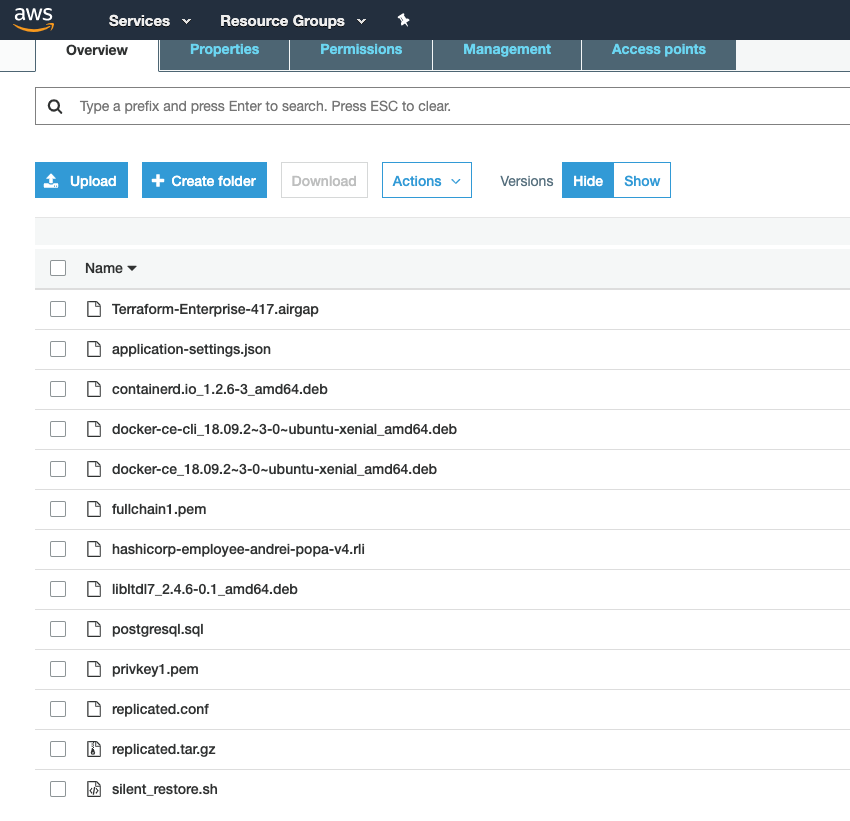

# Description
S3 bucket with all installation packages and configuration file dependencies for installation

Once the bucket is completed copy all the packages:

```bash
aws s3 cp file/ s3://ptfe-installation-bin --recursive --region eu-central-1
```

You should have similar view in your s3 bucket

```bash
-rw-r--r--@  1 apopa  staff  1064025557 Mar 23 22:50 Terraform-Enterprise-417.airgap
-rw-r--r--@  1 apopa  staff  1064012307 Mar 23 22:50 Terraform-Enterprise-419.airgap
-rw-r--r--   1 apopa  staff        1954 Mar 23 22:50 application-settings.json
-rw-r--r--   1 apopa  staff    22610446 Mar 23 22:50 containerd.io_1.2.6-3_amd64.deb
-rw-r--r--   1 apopa  staff    12993236 Mar 23 22:50 docker-ce-cli_18.09.2~3-0~ubuntu-xenial_amd64.deb
-rw-r--r--   1 apopa  staff    17371786 Mar 23 22:50 docker-ce_18.09.2~3-0~ubuntu-xenial_amd64.deb
-rw-r--r--@  1 apopa  staff       10752 Mar 23 22:50 hashicorp-employee-andrei-popa-v4.rli
-rw-r--r--@  1 apopa  staff       38292 Mar 23 22:50 libltdl7_2.4.6-0.1_amd64.deb
-rw-r--r--   1 apopa  staff         254 Mar 23 22:50 postgresql.sql
-rw-r--r--   1 apopa  staff         499 Mar 23 22:55 replicated.conf
-rw-r--r--@  1 apopa  staff   781721778 Mar 23 22:50 replicated.tar.gz
-rw-r--r--   1 apopa  staff        1449 Mar 23 22:50 silent_restore.sh
➜  files git:(master) ✗ pwd
../ptfe-aws-es-upgrade/files
```

